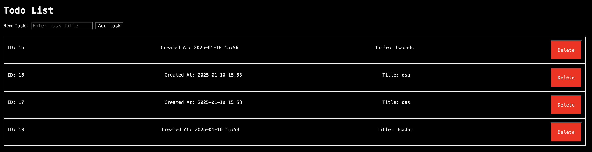

# Typical TODO list app.
- api
  - `get` | all posts
    - `/posts`
      ```json
      [
        {
            "id": 1,
            "title": "...",
            "created_at": 2025-01-10T15:56:44.336602+03:00
        },
        {
            "id": 2,
            "title": "...",
            "created_at": 2025-01-10T15:56:44.336602+03:00
        },
      ]
      ```
  - `post` | 1 post
    - `/posts`
      ```json
      {
          "title": "Some title"
      }
      ```
  - `delete` | 1 post by id
    - `/posts/:id`
  - `/` | index.html

# index.html

# why?
because try to use go...

# packages
- gin
- gorm
  - sqlite

# how to run?
```sh
cd todo-go
go run main.go
```
# how to build and run?
```sh
cd todo-go
go build
./todo-go
```
